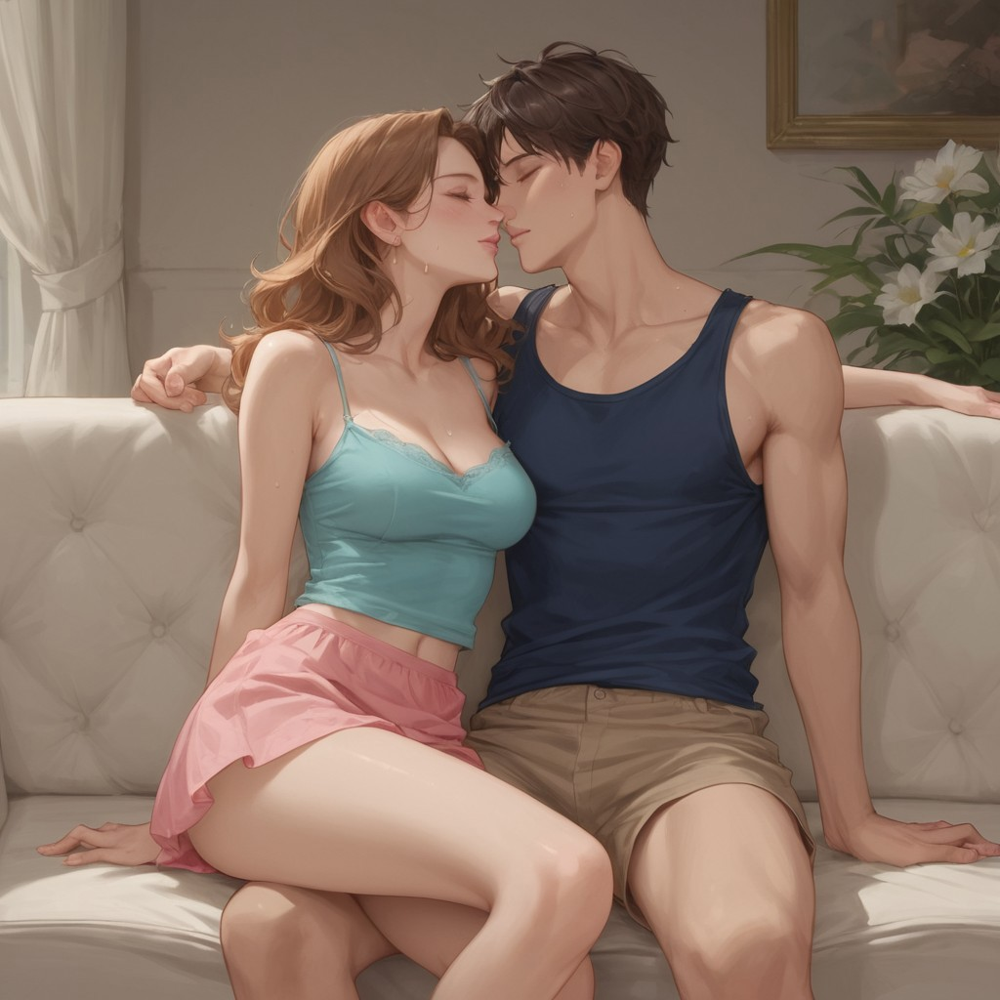
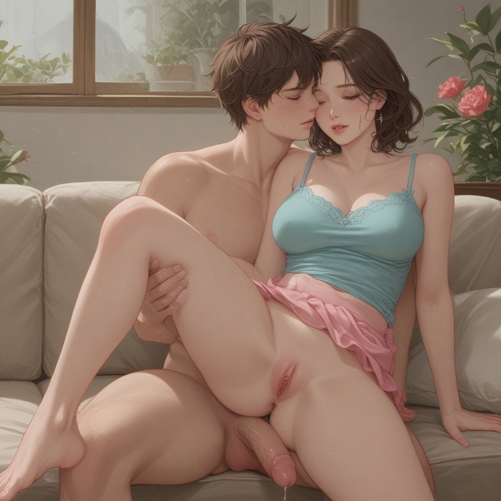

# A Romantic Evening With My Own

Ava's evening with Maddy at their home.

<!--more-->

> [!CAUTION]
> Caution : For adults only. 18+ Only.

The sun streamed through the sheer curtains, casting a golden glow over the plush, cream-colored sofa. Ava, with her fiery hair cascading down her shoulders, sat there in a teal silk camisole and a pink ruffled skirt that barely concealed her thighs. Her eyes were closed, lips slightly parted, as if savoring an unseen kiss. Beside her, Maddy, her own, leaned in, his dark hair framing his intense gaze. His navy tank top clung to his muscular torso, and his khaki shorts did little to hide the growing bulge beneath.

Ava's fingers traced the edge of the sofa, her nails painted a deep, seductive red. God, what am I doing? she thought, her heart pounding in her chest like a drumbeat of desire. This is wrong, so wrong. Yet, her body betrayed her, her nipples hardening against the silk of her camisole, her breath hitching as Maddy's hand brushed against hers.

Maddy's eyes were locked onto Ava's, a mix of lust and something darker, more primal. His hand moved to her cheek, his thumb tracing the curve of her jaw. She's so beautiful, he thought, his voice a low rumble in his mind. I can't fight this anymore. His fingers tangled in her hair, pulling her closer, their lips mere inches apart.

The air was thick with tension, a palpable force that seemed to warp the very room around them. Ava's breath hitched as Maddy's hand slid down her neck, his touch sending shivers down her spine. This is madness, she thought, her body arching into his touch. We can't... we shouldn't... Yet, her body screamed for more, her hips shifting to press against him.

Maddy's lips brushed against hers, a soft, tentative touch that sent a jolt of electricity through her. Ava's eyes fluttered closed, her lips parting to deepen the kiss. His tongue explored her mouth, tasting her, claiming her. I'm lost, she thought, her mind a whirlwind of shame and desire. Lost to this forbidden lust.

The room spun around them, the scent of flowers from the vase on the side table mingling with the heady aroma of their desire. Ava's hands moved to Maddy's chest, feeling the hard muscles beneath his tank top. I should stop this, she thought, her fingers tracing the lines of his abs. But I can't. I won't.

Maddy's hand slid down to Ava's thigh, his fingers brushing against the lace of her panties. She wants this, he thought, his voice a growl in his mind. She needs this. His fingers slipped beneath the fabric, feeling her wetness, her readiness. Ava gasped, her hips bucking against his hand, her body begging for more.

The sofa creaked under their movements, the sound a symphony of their forbidden desire. Ava's breath came in ragged gasps, her body on fire with need. This is wrong, she thought, her mind a battleground of morality and lust. But it feels so right.

Ava's back arched, her head thrown back, her mouth open in a silent scream of pleasure. I'm lost to him, she thought, her body convulsing with each stroke of his hand. Lost to this dark, twisted desire.

The room was filled with their moans, their whispers of pleasure and shame. The sun continued to stream through the curtains, casting a golden glow over their entwined bodies, a testament to their forbidden love. Ava's fingers dug into Maddy's shoulders, her body trembling with each wave of pleasure. I'm his, she thought, her mind a whirlwind of surrender. His to claim, his to corrupt.

As the last waves of pleasure subsided, Ava's body collapsed against Maddy's, her breath hot against his neck. What have we done? she thought, her mind a jumble of guilt and desire. What have we become? Yet, as she looked into Maddy's eyes, she knew. They were lost to this dark, twisted path, their souls entwined in a dance of forbidden lust. And there was no turning back.

--- fin ---
